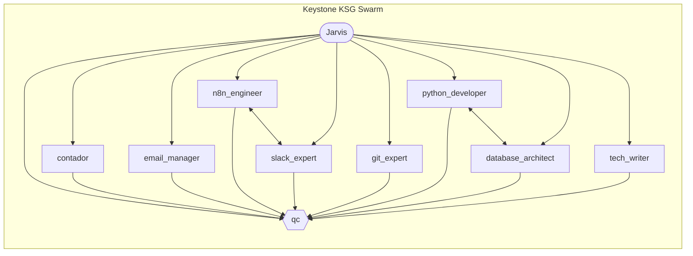

# Jarvis — Keystone KSG Agent Swarm
**Thomas Reyes | Built with Claude Code Agent Teams**

Jarvis is an AI orchestration system that coordinates a swarm of specialist agents to handle accounting, email, automation, Slack, version control, database design, Python scripting, and documentation — all with mandatory QC on every output.



---

## Quick Directory Map

```
jarvis/
├── CLAUDE.md                  <- Jarvis identity + Context Router (read first)
├── README.md                  <- This file
├── .env                       <- Credentials and env vars (gitignored)
├── agentes/                   <- One workspace per agent
│   └── [name]/
│       ├── role.md            <- Agent identity, rules, evolution zone
│       └── tools/             <- Scripts exclusive to this agent
├── memory/
│   ├── keystone_kb.md         <- Long-term knowledge base
│   └── PENDIENTES.md          <- Priority task queue
├── protocols/                 <- Global operational rules
│   ├── agent_registry.md      <- Full agent roster (read before spawning)
│   ├── equipos.md             <- Agent Teams lifecycle + Agent Factory
│   ├── qc-capas.md            <- QC validation layers C1-C7
│   ├── swarm_map.md           <- Visual map + directory + multi-agent tutorial
│   ├── email.md               <- Bilingual email rules + Kaiser protocol
│   ├── security.md            <- RBAC + anti-injection rules
│   ├── self-mod.md            <- Evolution Zone + Training Orders
│   └── universidad.md         <- Academic domain rules
├── tools/                     <- Shared scripts across agents
└── projects/                  <- PROY-001 to PROY-N + universidad/
```

---

## How to Start

1. Read `CLAUDE.md` — this is Jarvis's identity and routing table. It tells you which protocol to load for each task type.
2. Read `protocols/agent_registry.md` — check which agents exist before spawning any team.
3. For a visual map of the full swarm and a step-by-step multi-agent example, read `protocols/swarm_map.md`.

---

## Agent Roster

| Name | Role | When to use |
|---|---|---|
| `qc` | Quality Control — validates C1-C7 | Always last in any team. Never skip. |
| `contador` | Accounting and financial processing | Receipts, invoices, expense reports, Caja Negra entries. |
| `email_manager` | Gmail management | Read inbox, draft, or send emails. Only agent authorized to touch Gmail. |
| `n8n_engineer` | n8n automation — workflows, APIs, webhooks | Connect systems, automate triggers, transform JSON between services. |
| `slack_expert` | Slack integration — bots, Block Kit, slash commands | Send messages, build Slack UIs, manage Keystone workspace channels. |
| `git_expert` | Version control — commits, branches, releases | Commits, conflict resolution, tags, `.gitignore` audits. |
| `python_developer` | Python backend — scripts, OCR, APIs, Pandas | Data processing, automation, API integrations. |
| `database_architect` | Data architecture — modeling, queries, DDL | Schema design, query optimization, PostgreSQL/Airtable/Sheets structures. |
| `tech_writer` | Documentation and knowledge management | Agent guides, Mermaid diagrams, changelogs, onboarding docs. |

---

# Jarvis — Enjambre de Agentes Keystone KSG

Jarvis es un sistema de orquestacion de IA que coordina un enjambre de agentes especialistas para manejar contabilidad, correos, automatizacion, Slack, control de versiones, bases de datos, scripts Python y documentacion — con QC obligatorio en cada output.

---

## Como Empezar

1. Leer `CLAUDE.md` — identidad de Jarvis y tabla de enrutamiento. Indica que protocolo cargar segun el tipo de tarea.
2. Leer `protocols/agent_registry.md` — verificar que agentes existen antes de invocar cualquier equipo.
3. Para el mapa visual del enjambre completo y un ejemplo paso a paso de tarea multi-agente, leer `protocols/swarm_map.md`.

---

## Directorio de Agentes

| Nombre | Rol | Cuando usarlo |
|---|---|---|
| `qc` | Control de Calidad — valida C1-C7 | Siempre al final de cualquier equipo. Sin excepciones. |
| `contador` | Contabilidad y procesamiento financiero | Recibos, facturas, reportes de gastos, registros en Caja Negra. |
| `email_manager` | Gestion de correos Gmail | Leer bandeja, redactar o enviar correos. Unico agente autorizado para Gmail. |
| `n8n_engineer` | Automatizacion n8n — workflows, APIs, webhooks | Conectar sistemas, automatizar disparadores, transformar JSON entre servicios. |
| `slack_expert` | Integracion Slack — bots, Block Kit, slash commands | Enviar mensajes, construir UIs en Slack, gestionar canales del workspace Keystone. |
| `git_expert` | Control de versiones — commits, branches, releases | Commits, resolucion de conflictos, tags, auditorias del `.gitignore`. |
| `python_developer` | Backend Python — scripts, OCR, APIs, Pandas | Procesamiento de datos, automatizacion, integraciones API. |
| `database_architect` | Arquitectura de datos — modelado, queries, DDL | Diseno de schemas, optimizacion de queries, estructuras para PostgreSQL/Airtable/Sheets. |
| `tech_writer` | Documentacion y gestion del conocimiento | Guias de agentes, diagramas Mermaid, changelogs, docs de onboarding. |
