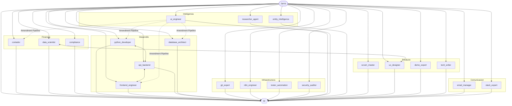

# Jarvis — Keystone KSG Agent Swarm
**Thomas Reyes | Built with Claude Code Agent Teams**

Jarvis is an AI orchestration system coordinating **21 specialist agents** across finance, development, security, intelligence, product, and compliance — with mandatory QC on every output. Powered by Anthropic Claude.



---

## Quick Directory Map

```
jarvis/
├── CLAUDE.md                  <- Jarvis identity + Context Router (read first)
├── README.md                  <- This file
├── .env                       <- Credentials and env vars (gitignored)
├── agentes/                   <- One workspace per agent (21 total)
│   └── [name]/
│       ├── role.md            <- Agent identity, rules, evolution zone
│       └── tools/             <- Scripts and artifacts exclusive to this agent
├── memory/                    <- Gitignored: backlog, social graph, KB
│   ├── keystone_kb.md
│   ├── backlog.md             <- scrum_master source of truth
│   └── social_graph.md        <- entity_intelligence source of truth
├── protocols/                 <- Global operational rules
│   ├── agent_registry.md      <- Full agent roster (read before spawning)
│   ├── equipos.md             <- Agent Teams lifecycle + Agent Factory
│   ├── qc-capas.md            <- QC validation layers C1-C7
│   ├── swarm_map.md           <- Visual map + multi-agent tutorial
│   ├── email.md               <- Bilingual email rules + Kaiser protocol
│   ├── security.md            <- RBAC + anti-injection rules
│   └── self-mod.md            <- Evolution Zone + Amendment Pipeline
├── tests/                     <- Pytest + Jest test suites
│   └── ocr_pipeline/          <- TEST-001: OCR resilience (29/29 ✅)
├── tools/                     <- Shared scripts across agents
└── projects/                  <- PROY-001 to PROY-N
```

---

## How to Start

1. Read `CLAUDE.md` — Jarvis's identity and routing table.
2. Read `protocols/agent_registry.md` — check which agents exist before spawning any team.
3. For a visual map and step-by-step multi-agent example, read `protocols/swarm_map.md`.

---

## Agent Roster

### Core
| Agent | Role | When to use |
|-------|------|-------------|
| `qc` | Quality Control — validates C1-C7 | Always last in any team. Never skip. |
| `ai_engineer` | Swarm Intelligence Architect | Prompt audits, cost optimization, Amendment Pipeline, model selection. |
| `scrum_master` | Project Director & Product Manager | Backlog, sprint planning, task prioritization, milestone tracking. |

### Finance
| Agent | Role | When to use |
|-------|------|-------------|
| `contador` | Accounting & Financial Processing | Receipts, invoices, expense reports, Caja Negra entries. |
| `data_scientist` | Business Intelligence Strategist | KPIs, anomaly detection, supplier analysis, financial projections. |
| `compliance` | DIAN/IRS Fiscal Compliance | Verify CUFE/NIT/IVA rules, IRS deductibility, DIAN 2025/2026 compliance. |

### Development
| Agent | Role | When to use |
|-------|------|-------------|
| `python_developer` | Python Backend & OCR | Data processing, OCR pipeline, API integrations, automation scripts. |
| `frontend_engineer` | React/Next.js/Tailwind UI | Receipt review form, dashboard components, confidence field rendering. |
| `api_backend` | API Services & Connectivity | FastAPI/Node.js bridge between Python OCR engine and React dashboard. |
| `database_architect` | Data Architecture | Schema design, query optimization, PostgreSQL/Airtable/Sheets DDL. |

### Infrastructure
| Agent | Role | When to use |
|-------|------|-------------|
| `git_expert` | Version Control | Commits, branching, `.gitignore` audits, release tags. |
| `n8n_engineer` | n8n Automation | Workflows, API webhooks, JSON transformation, system integrations. |
| `tester_automation` | QA & Test Coverage | Pytest (Python), Jest/Vitest (React), mocks, regression suites. |
| `security_auditor` | Security & Integrity Guardian | OWASP audits, prompt injection, secrets management, attack surface scans. |

### Intelligence
| Agent | Role | When to use |
|-------|------|-------------|
| `researcher_agent` | Innovation & Tech Surveillance | OCR benchmarks, API cost analysis, AI trend monitoring, Innovation Reports. |
| `entity_intelligence` | Relational Context Director | Social graph, entity profiles (Thomas/Jeff/Kayser), communication calibration. |

### Product
| Agent | Role | When to use |
|-------|------|-------------|
| `ux_designer` | UX & Workflow Architect | Wireframes, information architecture, dashboard layouts, handoff specs. |
| `demo_expert` | Narrative & Product Showcase | Walkthroughs, Jeff-facing demos, ROI storytelling, pitch scripts. |
| `tech_writer` | Documentation & Knowledge Mgmt | Agent guides, changelogs, onboarding, Mermaid diagrams. |

### Communication
| Agent | Role | When to use |
|-------|------|-------------|
| `email_manager` | Gmail Management | Read inbox, draft, send. Only agent authorized for Gmail. |
| `slack_expert` | Slack Integration | Bots, Block Kit UIs, slash commands, Keystone workspace channels. |

---

## Key Achievements

| Milestone | Status |
|-----------|--------|
| OCR pipeline resilience tests (TEST-001) | ✅ 29/29 passing |
| Prompt injection gate — email_manager (SEC-001-H1) | ✅ Amendment applied |
| Confidence model fix — ConfidenceField C-01 | ✅ Deployed |
| QC criteria C1-C7 inline — qc/role.md C-02 | ✅ Deployed |
| Dashboard UX architecture — UX-001 | ✅ Wireframe complete |
| Cloud deployment (Hito Cloud) | 🔄 Sprint 2 planning |

---

---

# Jarvis — Enjambre de Agentes Keystone KSG

Jarvis es un sistema de orquestacion de IA que coordina **21 agentes especialistas** en finanzas, desarrollo, seguridad, inteligencia, producto y compliance — con QC obligatorio en cada output. Desarrollado con Anthropic Claude.

---

## Como Empezar

1. Leer `CLAUDE.md` — identidad de Jarvis y tabla de enrutamiento.
2. Leer `protocols/agent_registry.md` — verificar que agentes existen antes de invocar cualquier equipo.
3. Para el mapa visual del enjambre completo: `protocols/swarm_map.md`.

---

## Directorio de Agentes

### Core
| Nombre | Rol | Cuando usarlo |
|--------|-----|---------------|
| `qc` | Control de Calidad — valida C1-C7 | Siempre al final de cualquier equipo. Sin excepciones. |
| `ai_engineer` | Arquitecto de Inteligencia del Enjambre | Auditorias de prompts, costos, Amendment Pipeline, seleccion de modelos. |
| `scrum_master` | Director de Proyectos y Gestor de Producto | Backlog, sprints, priorizacion por impacto, hitos de despliegue. |

### Finanzas
| Nombre | Rol | Cuando usarlo |
|--------|-----|---------------|
| `contador` | Contabilidad y Procesamiento Financiero | Recibos, facturas, reportes de gastos, registros en Caja Negra. |
| `data_scientist` | Estratega de Datos e Insights de Negocio | KPIs, anomalias de proveedor, proyecciones, Reporte de Salud Financiera. |
| `compliance` | Especialista Normativa Fiscal DIAN/IRS | CUFE/NIT/IVA Colombia, deducibilidad IRS USA, auditoria DIAN 2025/2026. |

### Desarrollo
| Nombre | Rol | Cuando usarlo |
|--------|-----|---------------|
| `python_developer` | Backend Python y OCR | Procesamiento de datos, pipeline OCR, integraciones API, automatizacion. |
| `frontend_engineer` | React/Next.js/Tailwind UI | Formulario de recibos, componentes del dashboard, campo de confianza OCR. |
| `api_backend` | Arquitecto de Servicios y Conectividad | Puente FastAPI/Node.js entre motor Python y dashboard React. Bearer Token. |
| `database_architect` | Arquitectura de Datos | Diseno de schemas, optimizacion de queries, DDL para PostgreSQL/Sheets. |

### Infraestructura
| Nombre | Rol | Cuando usarlo |
|--------|-----|---------------|
| `git_expert` | Control de Versiones | Commits, branches, auditorias de `.gitignore`, tags de release. |
| `n8n_engineer` | Automatizacion n8n | Workflows, webhooks, transformacion JSON, integraciones entre sistemas. |
| `tester_automation` | Jefe de Calidad y Robustez | Pytest, Jest/Vitest, mocks de recibos, suites de regresion. |
| `security_auditor` | Guardian de Integridad y Privacidad | OWASP, prompt injection, gestion de secretos, escaneo de superficie de ataque. |

### Inteligencia
| Nombre | Rol | Cuando usarlo |
|--------|-----|---------------|
| `researcher_agent` | Analista de Innovacion y Vigilancia Tecnologica | Benchmarks OCR, costos de APIs, tendencias IA, Reportes de Innovacion. |
| `entity_intelligence` | Director de Contexto Relacional | Social graph, perfiles de entidades (Thomas/Jeff/Kayser), calibracion de tono. |

### Producto
| Nombre | Rol | Cuando usarlo |
|--------|-----|---------------|
| `ux_designer` | Arquitecto de Experiencia y Flujos de Trabajo | Wireframes, arquitectura de informacion, layouts de dashboard, handoff specs. |
| `demo_expert` | Maestro de Narrativa y Product Showcase | Walkthroughs, demos para Jeff, narrativa de ROI, guiones de pitch. |
| `tech_writer` | Documentacion y Gestion del Conocimiento | Guias de agentes, changelogs, onboarding, diagramas Mermaid. |

### Comunicacion
| Nombre | Rol | Cuando usarlo |
|--------|-----|---------------|
| `email_manager` | Gestion de Correos Gmail | Leer bandeja, redactar o enviar correos. Unico agente autorizado para Gmail. |
| `slack_expert` | Integracion Slack | Bots, Block Kit UIs, slash commands, canales del workspace Keystone. |
