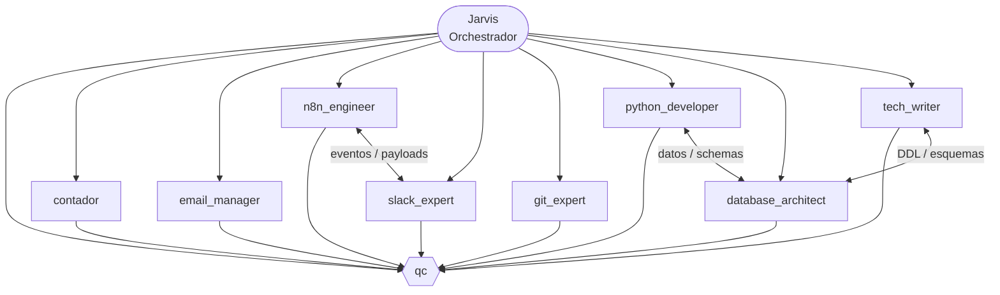
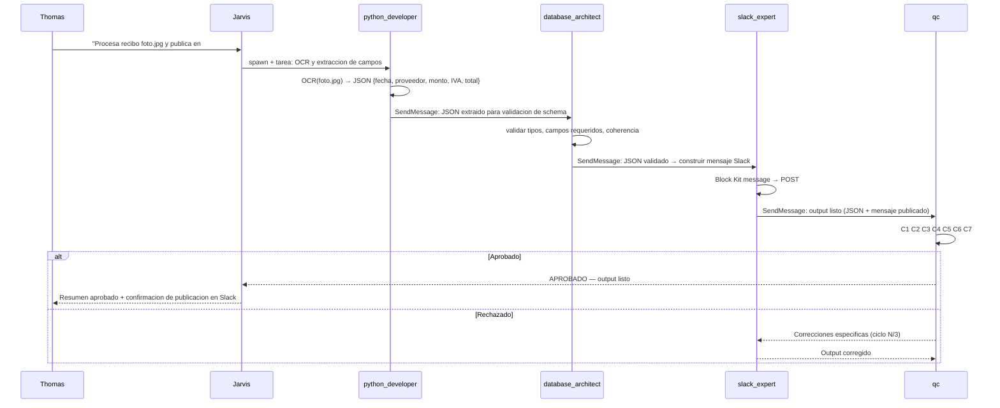

# Mapa del Enjambre — Keystone KSG
**Referencia para Thomas | Actualizado: 2026-03-23**

---

## Seccion 1 — Arquitectura del Enjambre

**Leyenda de formas:**
- `([...])` — Jarvis (estadio) — orquestador central
- `{{...}}` — `qc` (hexagono) — nodo de validacion obligatorio
- `[...]` — agentes especialistas (rectangulo)

**Conexiones clave:**
- Jarvis coordina a todos los agentes. Ningun agente actua sin haber sido invocado por Jarvis o por un teammate en un flujo P2P aprobado.
- Todos los agentes entregan a `qc`. Ningun output llega a Thomas o Jeff sin haber pasado las capas C1-C7.
- `python_developer` y `database_architect` colaboran directamente: el developer pasa datos estructurados y el arquitecto define o valida el schema.
- `n8n_engineer` y `slack_expert` colaboran directamente: n8n produce los payloads de automatizacion que slack_expert publica en el workspace.

---

## Seccion 2 — Directorio del Enjambre

| Agente | Especialidad | Cuando contactarlo | Workspace |
|---|---|---|---|
| `qc` | Control de Calidad — validacion C1-C7 | Siempre al final de cualquier equipo. Nunca saltarse este paso. | `agentes/qc/` |
| `contador` | Contabilidad y procesamiento financiero | Cuando hay recibos, facturas, reportes de gastos o registros en Caja Negra. | `agentes/contador/` |
| `email_manager` | Gestion de correos Gmail | Cuando se necesita leer bandeja, redactar o enviar correos. Es el unico agente autorizado para tocar Gmail. | `agentes/email_manager/` |
| `n8n_engineer` | Automatizacion n8n — workflows, APIs, webhooks | Cuando hay que conectar sistemas, automatizar disparadores o transformar JSON entre servicios. | `agentes/n8n_engineer/` |
| `slack_expert` | Integracion Slack — bots, Block Kit, slash commands | Cuando se necesita enviar mensajes, construir UIs en Slack o gestionar canales del workspace Keystone. | `agentes/slack_expert/` |
| `git_expert` | Control de versiones — commits, branches, releases | Cuando hay que hacer commit, resolver conflictos, crear tags o auditar el `.gitignore`. | `agentes/git_expert/` |
| `python_developer` | Backend Python — scripts, OCR, APIs, Pandas | Cuando hay que procesar datos, automatizar tareas o construir integraciones que no cubre n8n. | `agentes/python_developer/` |
| `database_architect` | Arquitectura de datos — modelado, queries, DDL | Cuando hay que disenyar schemas, optimizar queries o definir estructuras para PostgreSQL, Airtable o Sheets. | `agentes/database_architect/` |
| `tech_writer` | Documentacion y gestion del conocimiento | Cuando hay que crear o actualizar guias de agentes, diagramas, changelogs u onboarding docs. | `agentes/tech_writer/` |

---

## Seccion 3 — Guia de Primeros Pasos: Tarea Multi-Agente

### Caso de uso: "Extraer datos de un recibo y publicar el resumen en Slack"

Esta tarea encadena cuatro agentes: `python_developer` extrae los datos, `database_architect` valida el schema, `slack_expert` publica el mensaje, y `qc` aprueba el output final antes de que llegue a Thomas.

### Pasos

1. Decirle a Jarvis la tarea: "Procesa el recibo `foto.jpg`, guarda los campos estructurados y publica un resumen en el canal `#gastos` de Slack."
2. Jarvis lee `protocols/equipos.md` y verifica `protocols/agent_registry.md` para confirmar que los cuatro agentes existen.
3. Jarvis crea el equipo (`TeamCreate`) y define las tasks con dependencias. La task de `qc` se bloquea por todas las demas.
4. Jarvis invoca `python_developer`. El agente lee su `role.md`, ejecuta OCR sobre `foto.jpg` y extrae los campos (fecha, proveedor, monto, IVA, total) como JSON.
5. `python_developer` envia el JSON a `database_architect` via P2P (`SendMessage`). El arquitecto valida que el payload cumple el schema de la Caja Negra y confirma o corrige los tipos de datos.
6. `database_architect` envia el JSON validado a `slack_expert`. El experto construye el mensaje en Block Kit y lo publica en `#gastos`.
7. `slack_expert` notifica a `qc` que el output esta listo para validacion.
8. `qc` aplica las capas C1-C7 al output consolidado (JSON + mensaje Slack). Si aprueba, notifica a Jarvis. Si rechaza, envia correcciones al agente responsable (maximo 3 ciclos).
9. Jarvis entrega el resultado aprobado a Thomas en espanyol.

### Diagrama de Flujo de Mensajes

---

## Seccion 4 — Reglas de Oro del Enjambre

1. **Leer antes de actuar.** Jarvis lee `protocols/agent_registry.md` antes de invocar cualquier agente. Cada agente lee su `role.md` antes de ejecutar cualquier tarea.
2. **QC es obligatorio e innegociable.** Ningun output llega a Thomas o Jeff sin haber pasado las capas C1-C7. No hay excepciones.
3. **Un solo duenyo por output.** Nunca dos agentes trabajan sobre el mismo entregable al mismo tiempo. Las dependencias se mapean con `blockedBy` al crear las tasks.
4. **Maximo 3 ciclos de correccion.** Si `qc` rechaza el mismo error 3 veces, escalar a Thomas inmediatamente — no seguir iterando.
5. **Los agentes hablan entre si directamente.** Jarvis no triangula cada mensaje — los teammates usan `SendMessage` P2P. Jarvis solo interviene si hay bloqueo tras 2 rondas sin resolucion.
